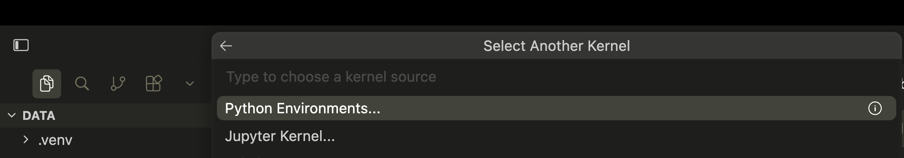
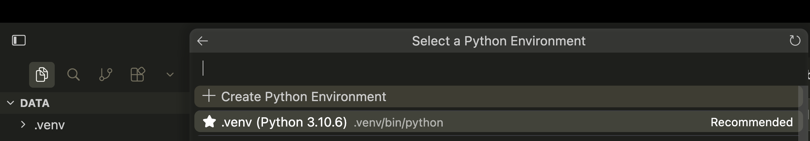
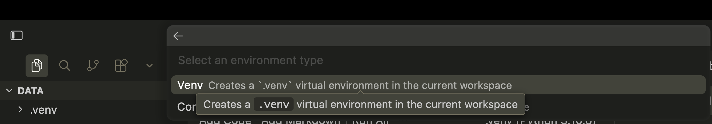
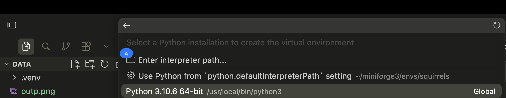

# Setup
{: .no_toc }

{:toc}

The concepts we cover are general and apply to many languages and tools. In this series we demonstrate how to code with Python using the Cursor Integrated Development Environment (IDE), which provides a simple way to incorporate AI into the coding process. What you learn throughout the workshop can apply to many environments and tools, and this is simply one way of doing things.

Complete this page before the hands-on workshops (especially workshops 2 and 3). We will use **Cursor** for AI-assisted coding and **Python** with **Jupyter notebooks** (`.ipynb`) to run examples, together with **pandas** and **matplotlib**.

We use Python in these workshops because it is widely used for data analysis and it integrates well with Cursor. You can write and run Python code alongside AI chat in the same workspace, which is practical for real projects.


---

## What you need

### Python, packages, and Jupyter

In this workshop we use Python **3.10 or newer**, plus these libraries and packages:

| Package / tool | Role |
|----------------|------|
| **pandas** | Load and work with tables |
| **matplotlib** | Create plots |
| **notebook** | Jupyter Notebook server so you can open and run `.ipynb` files (used in the workshops) |

---

### Cursor


1. Download Cursor from **[cursor.com](https://cursor.com)** and install it for your operating system.
2. Open Cursor. You will be prompted to sign in or create a free account.
3. Follow the setup prompts (plugins are not required). 
4. At the Cursor start page, open a chat: **`Cmd+L`** (Mac) or **`Ctrl+L`** (Windows / Linux).

**Policy Notes for Using Cursor :**

- **[Privacy Policy](https://www.cursor.com/privacy)** — how Cursor collects and uses data when you use the app.
- **[Pricing](https://www.cursor.com/pricing)** — free vs paid features; check what your use case needs (this workshop uses the free version).

{: .warn}
Only use Cursor with files that can be made public. All files in a Cursor _workspace_ may be indexed and shared with AI tools, even if you don't enter them into the chat. Never use Cursor with personal or confidential data.

More detail: [UBC AI guidance](ubc_ai_policy.html).


---

## Download the Palmer Penguins dataset

1. Create a project folder (you will open this folder later with Cursor)
2. In your project folder, create a folder named `data`
3. [Download penguins.csv](../data/penguins.csv) and save it in your `data` folder (right-click the link and select _Save Link As..._ or _Download Linked File As..._)
   
Preview of the data we'll work with:

| species | island | bill_length_mm | bill_depth_mm | flipper_length_mm | body_mass_g | sex | year |
|---------|--------|----------------|---------------|-------------------|-------------|-----|------|
| Adelie | Torgersen | 39.1 | 18.7 | 181 | 3750 | male | 2007 |
| Adelie | Torgersen | 39.5 | 17.4 | 186 | 3800 | female | 2007 |
| Adelie | Torgersen | 40.3 | 18.0 | 195 | 3250 | female | 2007 |
| Chinstrap | Dream | 46.5 | 17.9 | 192 | 3500 | female | 2007 |
| Gentoo | Biscoe | 46.1 | 13.2 | 211 | 4500 | female | 2007 |

**344 rows × 8 columns**


**Source:** [Palmer Penguins](https://allisonhorst.github.io/palmerpenguins/)  

**Artwork:** [Illustrations](https://allisonhorst.github.io/palmerpenguins/articles/art.html) by [@allison_horst](https://twitter.com/allison_horst)

---

## Quickest Demo: Set Up a Python venv Inside Cursor

Use this only as a fast way to get workshop notebooks running in Cursor.
For long-term projects, use a more managed Python workflow (for example: pinned dependencies and reproducible environment files).

Before starting this section:
- Finish the **Cursor** section above.
- Open your project folder in Cursor (the folder that contains `data/penguins.csv`).

### Step-by-step (beginner friendly)

1. In Cursor, open your project folder:
   - Menu: **File -> Open Folder...**
   - Select your workshop project folder.
2. Create or open a notebook file (`.ipynb`):
   - Menu: **File -> New File...**
   - Save it as `setup_check.ipynb` inside your project folder.
3. Open that notebook, then use the kernel selector in the top-right and choose **Select Another Kernel...**.

   

4. Choose **Python Environments...**.

   

5. Choose **Create Python Environment** and select **Venv**.

   

6. Pick the Python interpreter Cursor should use to create the environment.

   

7. Install workshop packages in the new environment:

   ```bash
   pip install pandas matplotlib notebook
   ```

8. Quick check in a notebook cell:

   ```python
   import pandas as pd
   import matplotlib.pyplot as plt
   ```

If the kernel does not switch automatically, reopen the kernel picker and select the newly created `.venv` interpreter.

---

### If you are familiar with Python
{: .no_toc }
Use your preferred Python installation and make sure the libraries and packages in the table above are installed (e.g. with `python -m pip install pandas matplotlib notebook`).


### Installing Python 
#### If you are new to Python and don’t already use a distribution

**Miniconda** is a small installer that includes **conda**, a package manager that makes it straightforward to install Python and libraries in an isolated environment. We recommend it when you don’t have another preferred setup.

1. Download **Miniconda** for your OS from the official docs: **[Miniconda — latest installer links](https://docs.anaconda.com/miniconda/install/)** (follow the install steps for Windows, macOS, or Linux).
2. Open a terminal (**Anaconda Prompt** on Windows, or Terminal on Mac/Linux).
3. Create an environment and install what we need (example name: `workshop`):

   ```bash
   conda create -n workshop python=3.10 -y
   conda activate workshop
   conda install -c conda-forge pandas matplotlib notebook -y
   ```

4. Check that Python runs: `python --version`

## Quick start workshops

1. **[Workshop 1: Fundamentals](workshops/01_fundamentals.md)**  
2. **[Workshop 2: Data analysis & visualization](workshops/02_data_analysis_visualization.md)**  
3. **[Workshop 3: Building with AI](workshops/03_building_with_ai.md)**

Workshops build on each other, but you can go at your own pace if you prefer.
