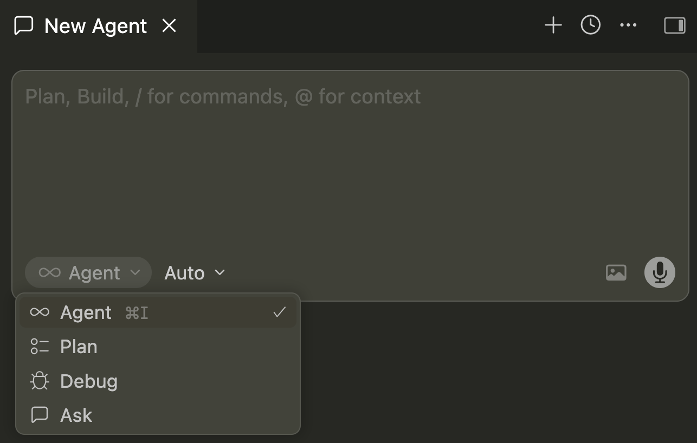
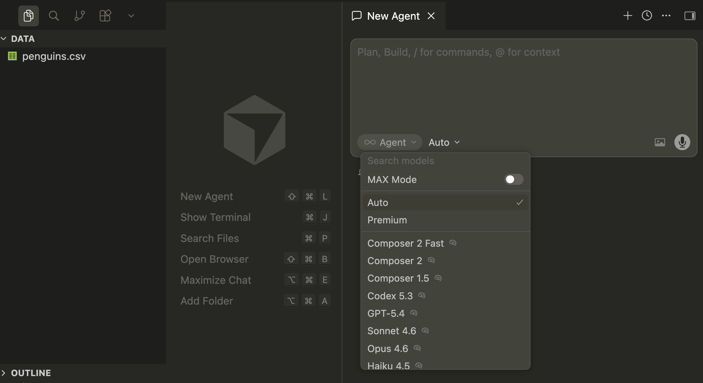
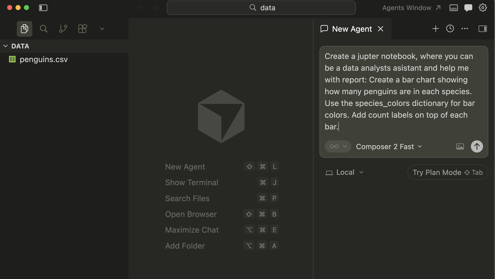
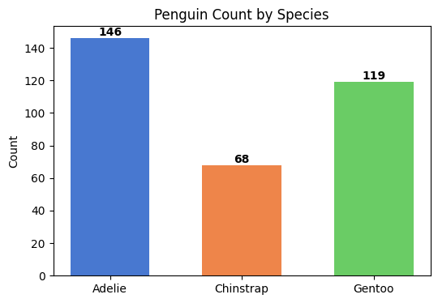
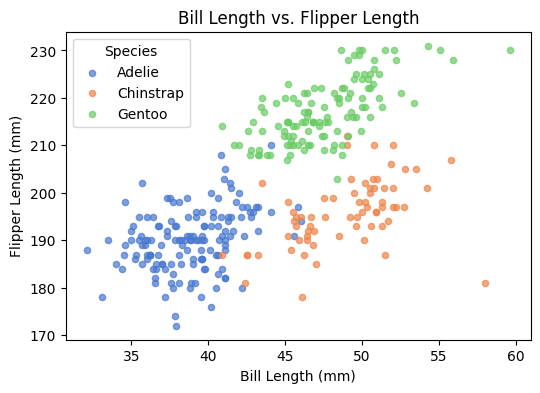
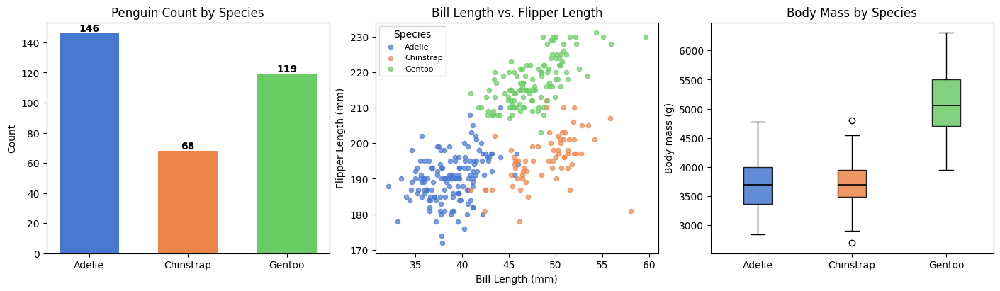

# 2. Data Analysis & Visualization

Create charts and plots with AI using **pandas** and **matplotlib**.

**Duration:** 30 min | **Tools:** Cursor, Python, pandas, matplotlib

{: .warn}
**Only use [Cursor](https://cursor.com/home) with files that can be made public.** All files in a Cursor _workspace_ may be indexed and shared with AI tools, even if you don't enter them into the chat. Never use Cursor with personal or confidential data.

More detail: [UBC AI guidance](../ubc_ai_policy.html).

---

## Learning objectives

By the end of this workshop, you will know:

- How to describe visualizations to AI
- When to use bar plots, scatter plots, and box plots
- Generate code by prompting Cursor (pandas and matplotlib)
- Build charts by specifying what you want, not syntax

---

## Setup (2 minutes)

```python
import pandas as pd
import matplotlib.pyplot as plt

penguins = pd.read_csv("data/penguins.csv").dropna()

species_colors = {
    "Adelie": "#4878d0",
    "Chinstrap": "#ee854a",
    "Gentoo": "#6acc65",
}
```


- We'll focus on **Agent mode** today. It helps you quickly build data analysis workflows and generate multi-step code with AI.


- Other modes:
  - **Ask**: For quick coding questions or short code snippets.
  - **Debug**: For help fixing errors.
  - **Plan**: For outlining or structuring coding tasks.



Choose **Auto mode** for now for demo and learning. This helps to get started quickly while the system handles the technical choices on the free plan.



Example: A generated plot workflow in Cursor (project with penguin data set up)

{:.callout-tip}

**Framework for Choosing a Chart Type**

Before jumping in to create your chart, lets step back and think about your data and **the story you want to tell**. When choosing a visualization type, ask yourself:

- **What do I want to show?**
    - A change over time? (e.g. line or area chart)
    - The distribution of values? (e.g. histogram, boxplot)
    - Parts of a whole? (e.g. pie chart, stacked bars)
    - A comparison of categories? (e.g. bar, column, dot plot)
    - A relationship/correlation? (e.g. scatter plot)
    - Geographical patterns? (e.g. maps)

- **What type of variables do I have?**
    - Are they **numeric** (numbers), **categorical** (names/groups), **ordinal** (ordered), or something else?
    - Is there a clear **independent** (predictor) and **dependent** (response/outcome) variable?

- **Which visual will best support my main message?**
    - Is my goal to make a comparison, show a trend, or highlight an outlier?
    - Will my audience understand this chart type easily?

*Why use this process?*  
Most of the time, a simple bar, line, or scatter plot is your best tool—they’re recognized and easy to interpret. Fancier visualizations exist, but they’re only helpful if they make your data more understandable or support your message.

{:.callout-info}
Want visuals and more advice? Another resource for chart type selection:
- [FT Visual Vocabulary](https://ft-interactive.github.io/visual-vocabulary/)
- For an interactive guide to matching data types and questions to chart types, see **[From Data to Viz](https://www.data-to-viz.com/)**.

---

## Chart 1: Bar Plot (Species Count)

**Cursor prompt:**
> "Create a bar chart showing how many penguins are in each species. Use the species_colors dictionary for bar colors. Add count labels on top of each bar."

```python
counts = penguins["species"].value_counts().sort_index()

fig, ax = plt.subplots(figsize=(6, 4))
colors = [species_colors[s] for s in counts.index]
bars = ax.bar(counts.index.astype(str), counts.values, color=colors, width=0.6)
ax.bar_label(bars, labels=counts.values, fontweight="bold")
ax.set_title("Penguin Count by Species")
ax.set_ylabel("Count")
ax.set_xlabel("")
plt.show()
```

Expected output:



---

## Chart 2: Scatter Plot (Bill vs. Flipper Length)

**Cursor prompt:**
> "Create a scatter plot with bill length on x-axis and flipper length on y-axis. Color by species using species_colors (one color per species). Add title and axis labels."

```python
fig, ax = plt.subplots(figsize=(6, 4))

for sp in ["Adelie", "Chinstrap", "Gentoo"]:
    sub = penguins[penguins["species"] == sp]
    ax.scatter(
        sub["bill_length_mm"],
        sub["flipper_length_mm"],
        c=species_colors[sp],
        label=sp,
        alpha=0.7,
        s=20,
    )

ax.set_title("Bill Length vs. Flipper Length")
ax.set_xlabel("Bill Length (mm)")
ax.set_ylabel("Flipper Length (mm)")
ax.legend(title="Species")
plt.show()
```

Expected output:



---

## Interactive Challenge (10 minutes)

Pick one of the tasks below and try building it live using Cursor Chat.  
**Bonus:** After you finish, comment in the chat and share which option you chose or what surprised you about the result!

**Pick a chart or summary to build:**

- [ ] **Box plot:** Body mass by species  
- [ ] **Histogram:** Flipper length, with overlays by species  
- [ ] **Summary table:** Average measurements per species  

**How to try it:**

1. Choose and check off an option above
2. Open Cursor Chat (`Cmd+L`)
3. Paste your chosen prompt (or write your own)
4. Run the generated code and review the output
5. **Comment:** In the chat, share which task you chose, your code, or any challenges or observations you discovered

**Prompt template to use:**
```
Create a [chart type] showing [what data]. Use species_colors for colors. Use matplotlib. Add title and labels.
```

Example challenge output:



---

## Key Takeaways

- Use **bar charts** for counts across categories
- Use **scatter plots** to see relationships between two measurements
- Use **box plots** to compare distributions
- Always **specify colors, titles, and labels** in your prompts

---

## Resources

- [Matplotlib documentation](https://matplotlib.org/stable/index.html)
- [Matplotlib gallery](https://matplotlib.org/stable/gallery/index.html) (examples by chart type)

---

**Previous:** [1. Fundamentals](01_fundamentals.md)  
**Next:** [3. Building with AI](03_building_with_ai.md)
